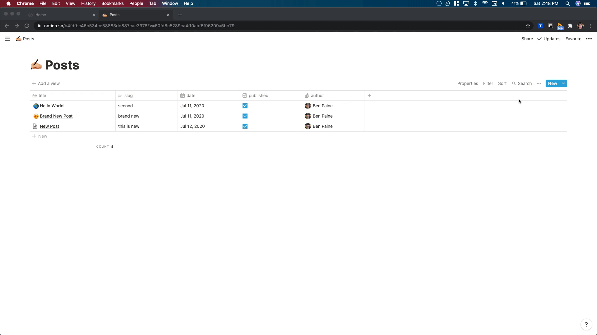

# No-Blog
### Create a blog with Notion as a CMS  
  
#### ⚠️ Still a little unstable. Use at your own risk ⚠️
#### Made by [Ben Paine](https://twitter.com/bnpneio)
  
## Get Started

1. Duplicate [this Notion template](https://www.notion.so/b4fdfbc46b534ce58883dd887cae3978?v=50fd8c5289ca4ff0abf6f96209a5bb79)
2. Copy the page ID for the **Post** page and paste it into `NOTION_BLOG_ID` in the `.env` file  
  - ex: if the url is `https://www.notion.so/b4fdfbc46b534ce58883dd887cae3978?v=50fd8c5289ca4ff0abf6f96209a5bb79` the id would be `b4fdfbc46b534ce58883dd887cae3978`
   

1. Put your first name into `MY_NAME` in the `.env` file

## Create Blog Post

1. Simply go to the Post page, and click 
2. Fill in the Page name, slug, Date, and Author
3. When you're ready, check published
4. Done, the slug and post will appear on the page

## Deploy to Vercel

#### ⚠️ Use at your own risk ⚠️

## Run Locally

1. Fork the Repository, clone it, and run `npm install`
2. Fill in the `.env` file
3. Run `npm run dev`

## License
[MIT](./LICENSE)
